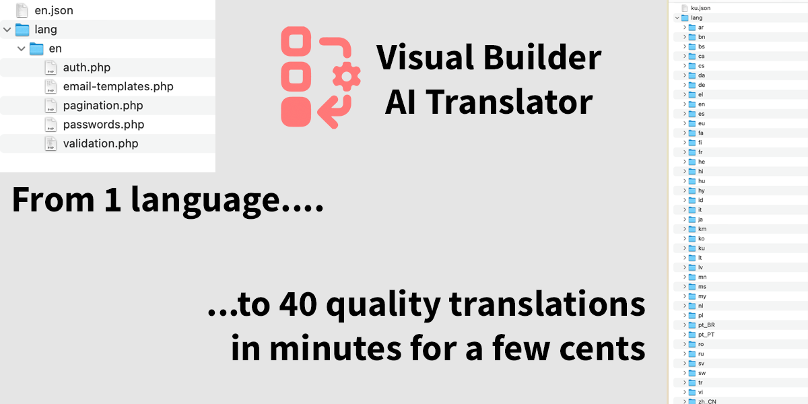
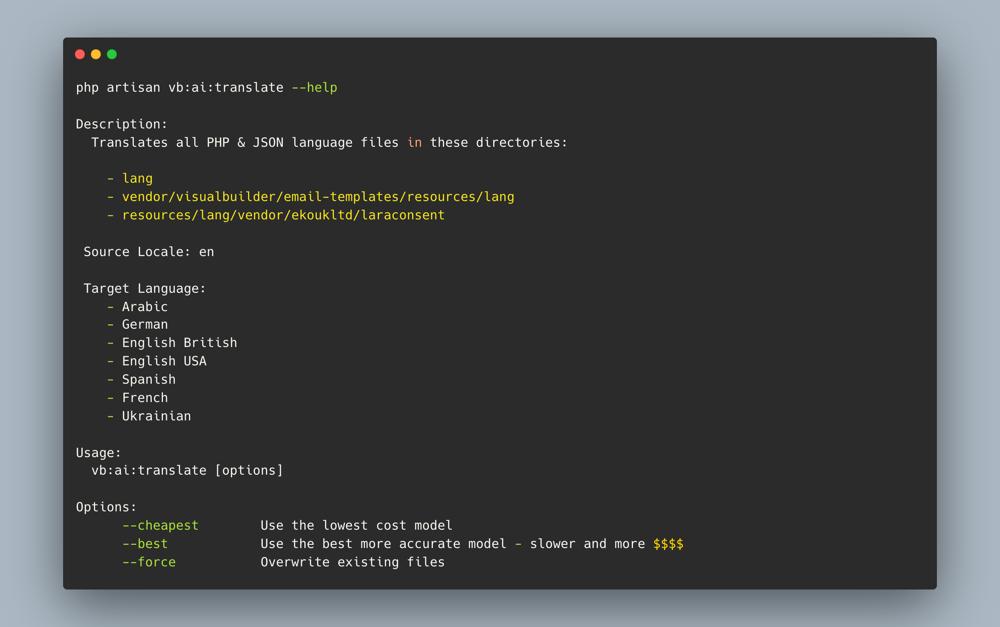
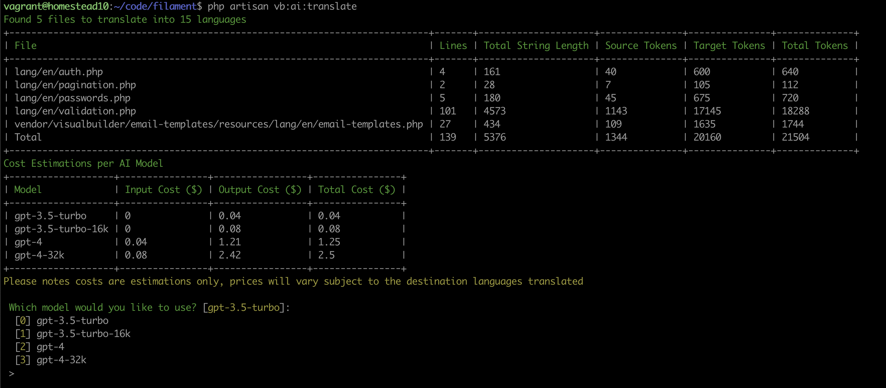

# AI Translator for Laravel locales  

[](https://packagist.org/packages/visualbuilder/ai-translate)
[](https://packagist.org/packages/visualbuilder/ai-translate)
[](https://github.com/visualbuilder/ai-translate/actions/workflows/run-tests.yml)
[](https://github.com/visualbuilder/ai-translate/actions/workflows/php-cs-fixer.yml)



 - Just set a list of languages that you would like your site translating to and leave it to GPT.
 - Can use GPT-3.5-turbo or GPT-4
 - Estimates cost before running
 - More accurate than Google Translate
 - Handles variables in the translation string - they will not be translated.
 - Handles both PHP and JSON files
 - Model translations coming soon

## Requirements

PHP 8.1 Is the minimum for the OpenAI Wrapper.

Tested with Laravel ^9.45 and 10.x

Filament is not required (but can add to their already awesome set of translations.)  


## Installation

Download the package via composer:

```bash
composer require visualbuilder/ai-translate
```

Run the install to copy the config files:-
```bash
php artisan vb:ai:install
```

This will create `config/ai-translate.php` and `config/openai.php` if it isn't already installed.

If you don't have GPT keys already visit: https://platform.openai.com/account/api-keys

Add these keys to your .env
```bash
OPENAI_API_KEY=sk-xxxxxxx
OPENAI_ORGANIZATION=org-xxxxxx
```

## Usage
Check the config file to make sure you have included the required source locale directories.
Copy from the list of known_locales the languages you wish to translate into the target_locales array.

Currently handles `.json` and `.php` translation files.
Attribute tokens should remain unchanged.  This was a challenge as GPT-3.5 refused to ignore :attribute and always translated it even when told explicity to ignore it.
To solve this all tokens are replaced with *** before translation and added back in after translation ensuring continuity.



To run the script:-

```bash
php artisan vb:ai:translate
```

The script will scan all the source_directories for translation files and then provide an estimate of the cost to translate into the required languages for each GPT Model.

If you're happy to continue, select the model you wish to use and each source file will be translated.



If the target file exists, only new keys not in the target will be translated. Unless you use the --force option which will overwrite any existing translations.


I will be adding additional capabilities for model translations and for Spatie Language lines.  I have these in a couple of projects so want to extend features.

### Testing

```bash
composer test
```

### Changelog

Please see [CHANGELOG](CHANGELOG.md) for more information what has changed recently.

## Contributing

Please see [CONTRIBUTING](CONTRIBUTING.md) for details.

### Security

If you discover any security related issues, please email support@ekouk.com instead of using the issue tracker.

## Credits

-   [Lee Evans](https://github.com/visualbuilder)

## License

The GNU GPLv3. Please see [License File](LICENSE.md) for more information.
